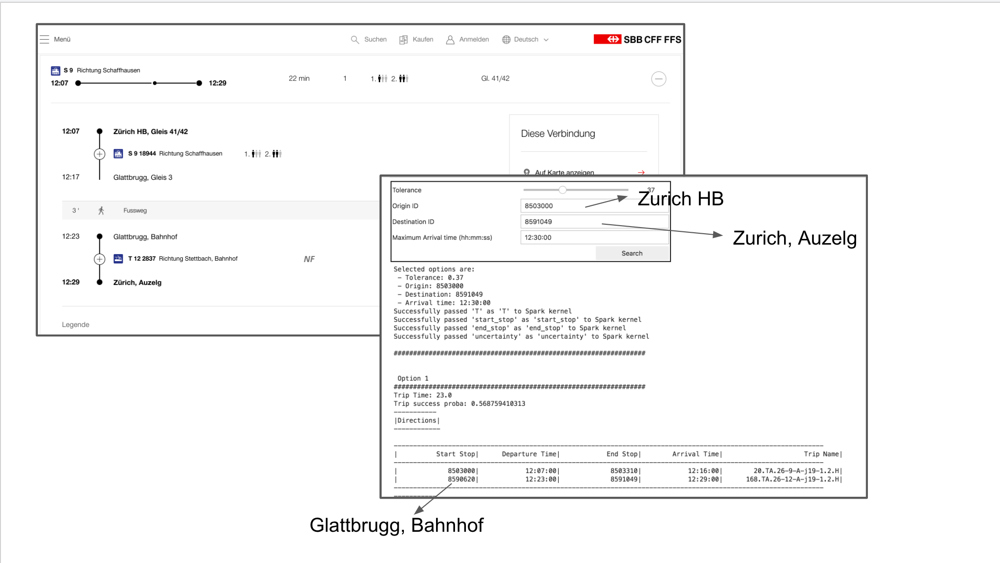

# Final Assignment: Robust Journey Planning

This is the final project repository for the class Lab in Data Science. Below you will see an overview of the content of repository as well as discussion of algorithms/models/approaches used.

# Presentation video

[Link here](https://drive.google.com/file/d/1zco6ToIGMeo54pxaxIsTebIr7yq3PwF8/view)

## Files (.ipynb) in notebooks/ folder

* [full_trip_planner](#full_trip_planner)
* [data_preprocessing](#data_preprocessing)
* [sbb_network_generation](#sbb_network_generation)
* [k_shortest](#k_shortest)
* [predictions](#predictions)

## Content 
* [Design and method used to model the public transport network](#design-and-method-used-to-model-the-public-transport-network)
* [Design and method used to create the predictive models](#design-and-method-used-to-create-the-predictive-models)
* [Route planning algorithm](#route-planning-algorithm)
* [Validation method](#validation-method)
* [Advantages and shortcomings of the proposed solution](#advantages-and-shortcomings-of-the-proposed-solution)
* [Extension opportunities](#extension-opportunities)
* [Work distribution](#work-distribution)

# full_trip_planner

Main file combining K-shortest and prediction model in one file with its visualization to easily demonstrate our work. The description of k shortest path and predictive model can be found below. You will find UI at the end of the full_trip_planner notebook.

<b>Our method finds routes from source to destination where success probability (reaching the destination not later than the indicated time) is greater than the indicated probability threshold. We were then given suggestions in the order of the latest time one can depart to reach the destination not later than the indicated time (with indicated certainty).</b>
    
# data_preprocessing 
    
This notebook contains a data cleaning and preparation procedure.

## 1) stops.txt

We read the stops file. We select all the unique stations (without platform information). Next we filter on radius and keep only stations that are within 15km from Zurich main station and we save the final list of stops <b>filtered_stops</b> for future usage as '/user/lortkipa/filtered_stops_Premoved.pkl'. We are left with approximately 1600 stations.

## 2) calendar.txt, trips.txt

Goal: Leave only services operating Mon-Fri. We read calendar.txt and select services <b>allowed_service_ids</b> that correspond to operation from Mo-Fri. Next we select trips <b>allowed_trips_ids</b> that belong to service in allowed_service_ids. We will use this information for the final filtering described below.

## 3) stop_times.txt

The goal of this part is to read stop_times file and only keep entries of stops/stations that are within 15km of Zurich using <b>filtered_stops</b>, have trips that are allowed according to <b>allowed_trips_ids</b> described above. Furthermore, we only keep entries concerning the normal time period, from 06:00 to 20:00. <b>filtered_stop_time</b> contains final filtered content of <b>stop_times</b> document.

## 4)current_next

Here we join <b>filtered_stop_time</b> on itself. We want each row of the new table to contain information about stations and its next station according to their route. For that reason we join <b>filtered_stop_time</b> on itself, where trip_ids are the same and stop_sequence of the first one equal to the stop_sequence-1 for the next one. This way we will have a row corresponding to a station and its next station according to the trip_id they are on. Joined table <b>current_next</b> is saved at 'hdfs:/user/lortkipa/current_next_6_22_Pcor.parquet' and will be used for transport graph generation. For more details of how individual rows look like see data_preprocessing.ipynb

# sbb_network_generation

In this notebook we will be constructing graph <b>G</b> to model the SBB network. For that we will be using first of all <b>current_next</b> dataframe described in the data_preprocessing section as well as <b>filtered_stops</b> also descrived in the <b>data_preprocessing</b> section.

To denote each stop/station we create <b>StationNode</b> datastructure, that has attributes such as station_id, departures, arrivals and walkable stations. Furthermore we define some helper functions of the StationNode to help us operate with it:

- station_id: id of station that the StatioNode corresponds to
- departures: dictionary of { departure_time: [(next_station_id, next_station_arrival, trip_id), ...], ... }
- arrivals: dictionary of { arrival_time: [(previous_station_id, prev_station_departure_time, trip_id), ...], ... }
- walkable_stations (stations within 500m distance): dictionary of {next_stop_id: walk_duration_second, ...}

To generate network we start with the Zurich main station (add it in <b>G</b>) and using <b>current_next</b> add all the stations accessible from Zurich with its times and trip_ids to the departures of Zurich main station node. Furthermore we also create a node for each new station discovered (add them in <b>G</b>) and add arrivals from Zurich to them. We also calculate nodes that are within 500m distance from Zurich and add them in the walkable_stations dictionary and create new Nodes for them as well (details of datastructures of each attribute is described above). Once Zurich is fully processed we continue with other newly discovered nodes, processing every node exactly once and performing the same procedure as described for the Zurich main station.
Finally, <b>G</b> Looks like this:
<b>G</b> = {
    
      stop_id1: StationNode1,
      stop_id2: StationNode2,
      ...

    }
    
For all stations accessible from Zurich HB within a 15km radius. Final <b>G</b> is saved as '/user/lortkipa/graph_untested_classTuples.pkl' ready for route planning algorithm.
    
At the end of the notebook is a validation section. To test that graph is generated correctly, we consider a ground truth route and make sure our SBB connections graph contains all the needed connections to end up with this ground truth route. The graphs passed all the tests and well-documented details are given in sbb_network_generation.ipynb notebook.
    
Table of content for this notebook:
    
0. Helper Functions
1. Global Parameters
2. Graph Generation
3. Validation
    
# k_shortest
    
For discovering the latest time one can leave to arrive not later than the specified time from one station to another, we use the modified k <b>shortest path</b> algorithm. More specifically, our algorithm is a constrained shortest paths algorithm. All the possibilities we consider are that it must be a valid route on the public transport infrastructure and schedule and arrive not later than the given time. Additionally, we tried to integrate threshold into the method as well as you can see, however, we still left both options there for an integrated approach.

The algorithm itself in the k_shortest notebook starts from the last (target) station and adds trips from new stations at each step according to <b>G</b> making sure such connections are feasible in time and allowed 2 minutes of transfer whenever the trip_id changes. Additionally, we also allow 2 minute transfer time (mostly for getting out of the transport, since it usually takes time) when walking from one station to the other, in addition to walking time. We make sure we only keep 15 shortest paths from any source to the destination, thus limiting algorithm complexity and making it more feasible regarding its time asymptotics.

We used ground truth given by TAs as well as manually generated samples using the SBB website and timetable. Our algorithm passed our tests and more details can be found in the validation section of the notebook.

Content of the notebook:

1. Helper Functions
2. Parameters/ Variables
3. K shortest path algorithm
4. Validation/Evaluation

# predictions

In this notebook, we build the prediction dataframes for transfer success probability using SBB Historical data. We then use the models to make a transfer success prediction function and test it.
The goal is to extract delays average and standard deviation for a specific trip, station, and time.

Table of contents of this notebook:

1. [Helper functions](#1.-Helper-functions)

Define useful library and functions to be used

2. [Data preprocessing](#2.-Data-preprocessing)

The SBB is loaded, filtered, and adapted to remove missing data, trips outside of the considered schedule, and stops outside of Zurich areas.

3. [Build prediction dataframe](#3.-Build-prediction-dataframe)

Extract delays average and standard deviation for different sets of parameters (options: StationId, TripId, DayPeriod).

4. [Transfer probability function](#4.-Transfer-probability-function)

Create a function that, given transfer information such as arrival and departure details, compute a probability that the transfer succeeds

5. [Validation](#5.-Validation)

Test the function for a few values to see if it work properly

# Design and method used to model the public transport network

To model the public transport network connection, graph G is created. G is a dictionary of station nodes, keys being stop id-s and it maps to its corresponding station node (generation code in sbb_network_generation.ipynb):

<b>G</b> = {

      stop_id1: StationNode1,
      stop_id2: StationNode2,
      ...

    }

<b>StationsNodes</b> are node classes corresponding to a specific station, each of them has parameter:
- station_id: id of station that the StatioNode corresponds to
- departures: dictionary of { departure_time: [(next_station_id, next_station_arrival, trip_id), ...], ... }
- arrivals: dictionary of { arrival_time: [(previous_station_id, prev_station_departure_time, trip_id), ...], ... }
- walkable_stations (stations within 500m distance): dictionary of {next_stop_id: walk_duration_second, ...}

More details and descriptions are given in the sbb_network_generation section of this README.

# Design and method used to create the predictive models

The main function of this problem is the transfer_success_probability function. Its function predicts the success probability of a transfer based on its information.

The process to build the prediction can be seen in multiple distinct parts:

1. Use historical data to make delay predictions

To build the prediction, we extracted from the SBB data the delays to compute three predictive models.

- Full prediction: compute a prediction given the stationId, tripId and dayPeriod
- Stop prediction: compute a prediction given the stationId, and dayPeriod
- Period prediction: compute a prediction given the dayPeriod

These three prediction dataframes help us to deal with missing data. Indeed, if some data is missing for a specific trip, we are going to use a simpler model with fewer parameters. For example, if the prediction data for specific tripId is missing in the historical data, we will call the Stop prediction model.

2. Approximate the historical data into a probability distribution

We considered two probabilistic approximation of the delays distribution

2.1. Exponential approximation

Exponential random variables are often used to model delays and fits quite well with our data. It was our first choice for model prediction. Nevertheless, this distribution does not take into account the possibility of arriving early. The distribution takes only positive values.

Therefore, when we have null or negative delay average, we can't use exponential distribution. For this reason, we finally choose to approximate the delay as a normal distribution.

2.2. Normal approximation

From the 3 prediction models we have, we can extract the normal distribution parameters (average and std dev) for both arrival and departure delays. That distribution help is to compute the probability threshold for delay values.

More precisely, we are going to represent the delay difference value as following the joint distribution of two independent Normal random variables that correspond to the difference between arrival delay and departure delay.

3. Use transfer parameters and matching distributions to compute the success probability.

The transfer prediction function does the following:

INPUT:

-station1_id
-trip1_id
-trip1_arrival_time
-station2_id
-trip2_id
-trip2_departure_time

We first compute the transferred surplus, corresponding to the remaining time at transfer after removing a minimum of 2 minutes and the walking time between stations if any.

Then, knowing that Arrival_delays ~ N(avg_arrival, std_arrival) and Departure_delays ~ N(avg_departure, std_departure).

We want to compute the probability that the time loss due to delay is smaller than the transfer time surplus (so that the transfer is a success): P(Delay loss <= transfer_surplus) = P(Arrival_delay - Departure_delay <= transfer_surplus)

The Arrival_delays and Departure_delays random variables are considered to be independent. Let Y = Arrival_delays - Departure_delays be the delay loss random variable. Use basic probability rules, we find that: Y ~ N(avg_arrival - avg_departure, sqrt(std_arrival^2 + std_departure_2))

Once we have the transfer_surplus value and the normal approximation, we simply compute the probability that the Delay Loss is smaller than the transferred surplus. This corresponds to our transfer success probability.

To compute an overall journey success probability, knowing that each transfer success is independent, we multiply the probability for each transfer.

# Route planning algorithm

The route planning algorithm corresponds to the shortest path algorithm with the probability threshold added.

We first added the transfer_success_probability function to the k_nearest algorithm so that each time a new path is possible, it will compute the underlying transfer probability. Nevertheless, the solution was not time efficient due to the very high number of calls of the prediction function.
We, therefore, changed it to the following:

1. We first run the algorithm without the probability threshold and select the 10 shortest paths.
2. If at least one of the given paths have a probability higher than the threshold, we keep this result and output all working paths.
3. If none of the found paths have the minimum probability, we run the algorithm a second time, looking for 2 shortest paths with the threshold parameter (time inefficient).

By doing this, we avoid in most cases having run the shortest_path algorithm with threshold and make many calls to the prediction function. 
Nevertheless, we still give a suitable answer, as if the initial result does not contains probable enough routes, we call the algorithm twice, to force the threshold.

# Validation
 

We used different steps for validation. We validated each step separately, as well as final results. First of all we validated the graph that we used for modeling the SBB network. Details of validation are given in the sbb_network_generation section. Furthermore, we used tests given by the TAs as well as our tests to validate the k-shortest path algorithm without probabilities. Our algorithm passes all the tests as described more in detail in the corresponding sections. Then, we made simple test cases for the probability function to validate it. Those tests check if the probability evolves correctly base on station distances, scheduled arrival, and departure difference, as well as the edge case for the terminal station. The results were meaningful for all cases. Finally, for the route planning algorithm with probabilities, we compared some examples results with SBB application and checked results for different probability thresholds.

# Advantages and shortcomings of the proposed solution

## Disadvantages
- Full application: Considering only weekdays, and only one schedule for all week

- K shortest: Might miss some results, BFS or DFS more powerful

- Predictions: Not considering transport type, or some other interesting variable, assume independence of delays (condition given in the description), time inefficient if predictions directly added to the graph

## Advantages
- Easy to use
- User can select the minimum success probability he wants
- Predictions are robust and never missing (low dimensionality)
- Extendable

# Extension opportunities

- Consider walking speed
- Additional ranking (# of transfers, missing consequences, etc.)
- Add dependence of delays
- Consider more parameters for the delay prediction

# Work distribution

Rabeeh Karimi: Data pre-processing, Visualization and its integration

Manana Lortkipanidze: Graph, K shortest

Pierre Schutz: Predictive model, K shortest integration

Devavrat Tomar: Data pre-processing, Graph and K shortest validation

